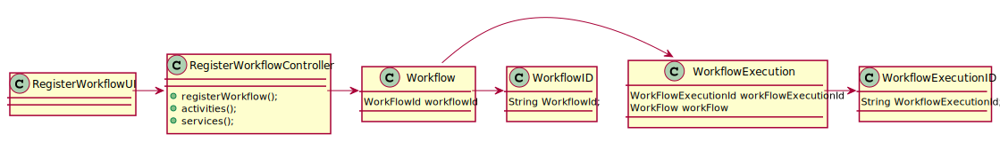
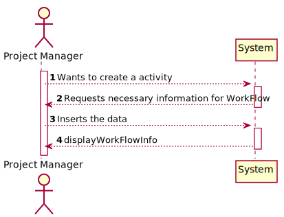
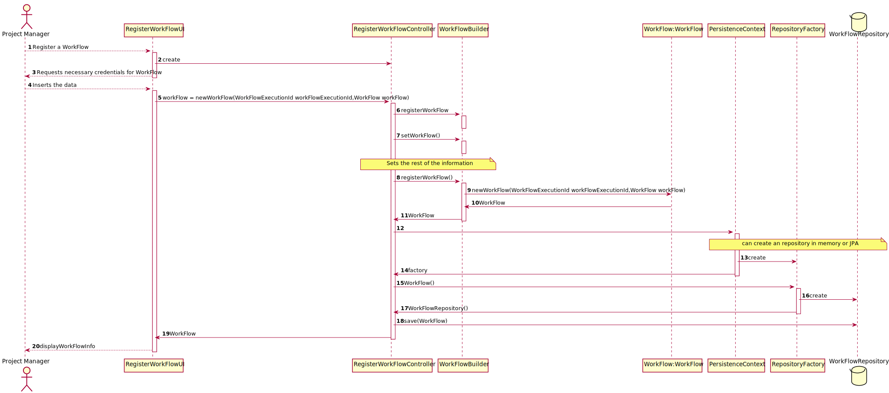

##**Class Diagram**


##**System Sequence Diagram**   


##**Sequence Diagram**



##**Tests**
```java

public class WorkFlowTest {

    public WorkFlow dummyWorkflow(final WorkFlowId id) {
        
    }

    public static SystemUser dummyUser(final String username, final Role... roles) { 
        
    }

    private SystemUser getNewDummyUser() {
        
    }

    private WorkFlow getNewDummyWorkflow() {
        
    }

    private WorkFlow getNewDummyWorkflowTwo() {
        
    }

    @Test
    public void ensureWorkflowEqualsPassesForTheSameWorkflowID() {
        
    }

    @Test
    public void ensureWorkflowEqualsFailsForDifferenteWorkflowID() {
    }

    @Test
    public void ensureWorkflowEqualsAreTheSameForTheSameInstance() {
    }

    @Test
    public void ensureWorkflowEqualsFailsForDifferenteObjectTypes() {
    }

    @Test
    public void ensureWorkflowIsTheSameAsItsInstance() {
    }

    @Test
    public void ensureTwoWorkflowWithDifferentWorkflowIDsAreNotTheSame() {
    }
}

```
