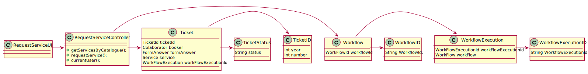
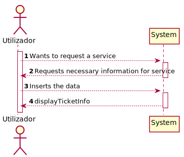
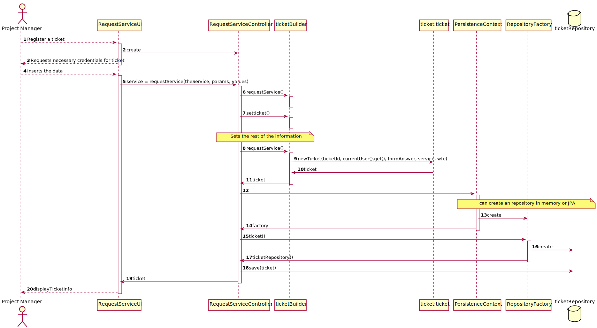

##**Class Diagram**


##**System Sequence Diagram**   


##**Sequence Diagram**



##**Tests**
```java
public class ServiceTest {
    
    @Test
    public void ensureServiceEqualsPassesForTheSameServiceCode() throws Exception {
        
    }

    @Test
    public void ensureServiceEqualsFailsForDifferenteServiceCode() throws Exception {

    }

    @Test
    public void ensureServiceEqualsAreTheSameForTheSameInstance() throws Exception {

    }

    @Test
    public void ensureServiceEqualsFailsForDifferenteObjectTypes() throws Exception {

    }

    @Test
    public void ensureServiceIsTheSameAsItsInstance() throws Exception {

    }

    @Test
    public void ensureTwoServiceWithDifferentServiceCodesAreNotTheSame() throws Exception {

    }
}

```
